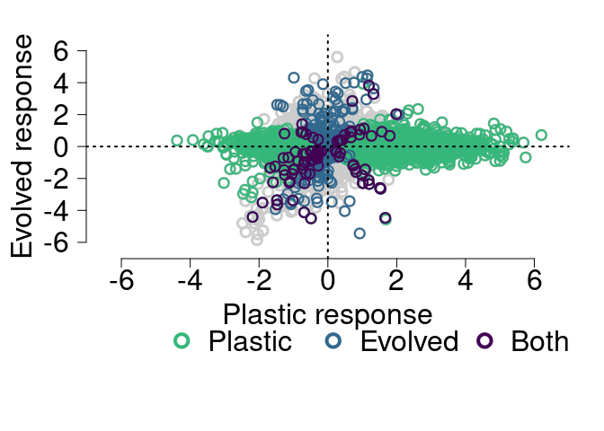
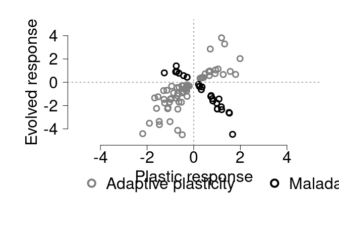
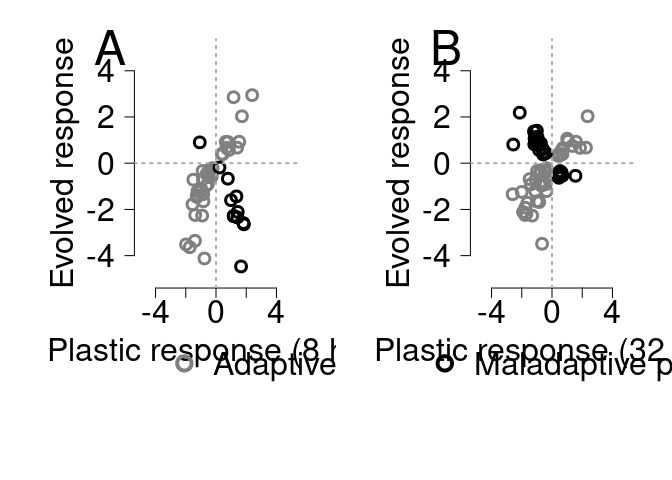
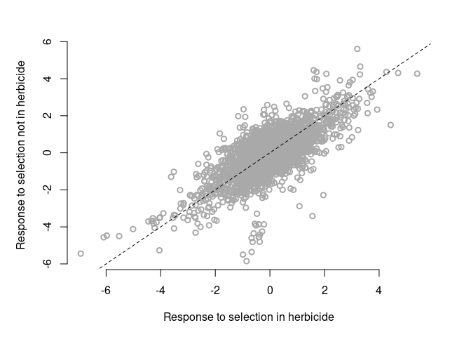
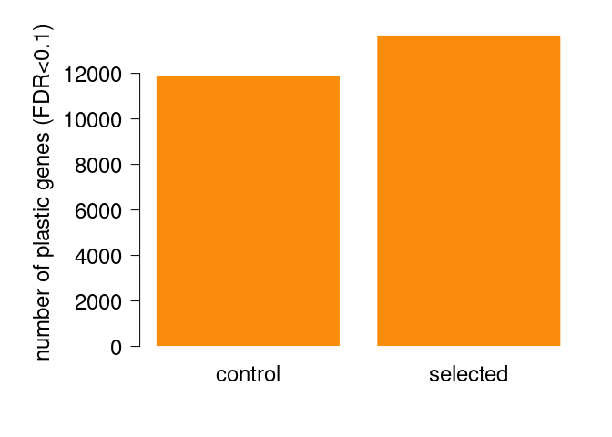
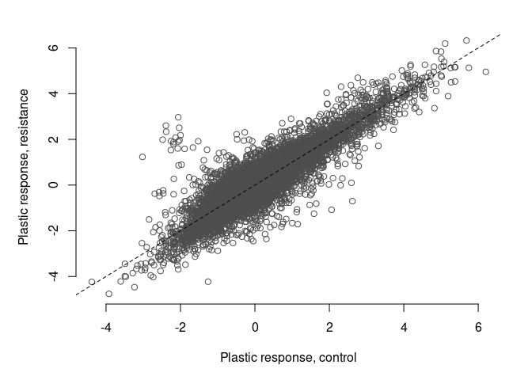
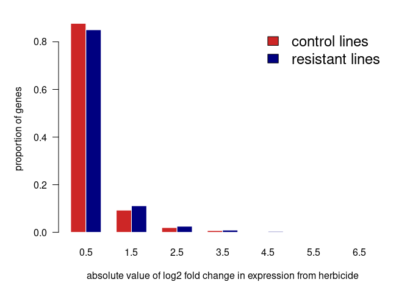

### Read in data

```r
#Read in csv of samples/treatment/slnline
sample1<-read.csv("data/samples-1.csv", stringsAsFactors=T)
sample2 <- sample1[,-3]

## read in expression data
readCounts<- read.csv("data/allcounts_morningGory_orthologyv2.csv",check.names=FALSE)

##transpose
tCounts = t(readCounts[,-c(1:8)])
tCounts = data.frame(tCounts, stringsAsFactors = F)
names(tCounts) = readCounts$Geneid

##get in the same order as the sample data
tCounts$LibraryName = sapply(rownames(tCounts), function(x){as.numeric(strsplit(x, split='_')[[1]][1])})
tCountsSample = dplyr::left_join(sample2, tCounts, by = "LibraryName")

##
mycounts <- DGEList(counts=t(tCountsSample[,-c(1:10)]))

###remove the susceptible selection lines
mycounts = mycounts[,sample1$slnline!='S'] 
sample1 = sample1[sample1$slnline != 'S',]
sample1$slnline = droplevels(sample1$slnline)


###samplesizes
nrow(dplyr::filter(sample1, spraytrt == "S"& slnline=="C")) #control sprayed 
```

```
## [1] 16
```

```r
nrow(dplyr::filter(sample1, spraytrt == "NS"& slnline=="C")) #control not sprayed
```

```
## [1] 15
```

```r
nrow(dplyr::filter(sample1, spraytrt == "NS"& slnline=="R")) #resistant not sprayed
```

```
## [1] 15
```

```r
##number of genes

#make the design matrix for selection line and spray treatment and the interaction
design <- model.matrix(~ slnline + spraytrt + slnline*spraytrt, data = sample1)

##filtering genes by expression
dim(mycounts$counts)[1] ##number of genes before
```

```
## [1] 53974
```

```r
keepGenes <- filterByExpr(mycounts, design=design)
mycounts <- mycounts[keepGenes, keep.lib.sizes=FALSE]
dim(mycounts$counts)[1] ##number of genes after filtering
```

```
## [1] 27037
```

```r
#get normalization factors 
mycounts <- calcNormFactors(mycounts, method = "TMM")

annotdf = data.frame(gene = readCounts$Geneid, Chr = readCounts$Chr, Start = readCounts$Start, End = readCounts$End,closestATG = readCounts$'Closest ATG', atgp = readCounts$`ATG p-value`)

save(sample1,mycounts, annotdf, file="data/filteredcounts_reference.rda")
```

### Identify genes that show plasticity to roundup within the control selection line


```r
mycontrol = mycounts[,sample1$slnline=='C'] ##subset just the control lines (this data has been filtered for expression level above)
mycontroldata = sample1[sample1$slnline=='C',] ##subset the sample data
designc <- model.matrix(~ spraytrt, data = mycontroldata) ##make the design matrix
vc <- voom(mycontrol, designc) ##VOOM
fitc <- lmFit(vc, designc) ## 
fitc <- eBayes(fitc)
summary(decideTests(fitc, p.value=0.1))
```

```
##        (Intercept) spraytrtS
## Down          4627      5734
## NotSig        1907     15132
## Up           20503      6171
```

```r
plasresults = topTable(fitc, p.value=1, number = nrow(mycontrol))
```

```
## Removing intercept from test coefficients
```

```r
save(plasresults, file = "data/plasticresults_reference.rda")
write.table(rownames(dplyr::filter(plasresults, adj.P.Val < 0.1)), file="data/plasresults_fdr.1.txt", quote=F, row.names=F, col.names=F)
write.table(rownames(plasresults), file="data/allgenestested.txt", quote=F, row.names=F, col.names=F)
```

### Identify genes that show evidence of selection in nonsprayed conditions


```r
myns = mycounts[,sample1$spraytrt=='NS'] ##subset just the NS lines 
mynsdata = sample1[sample1$spraytrt=="NS",]
designns <- model.matrix(~ slnline, data = mynsdata) ##make the design 
vns <- voom(myns, designns) ##VOOM
fitns <- lmFit(vns, designns) ## 
fitns <- eBayes(fitns)

summary(decideTests(fitns, p.value=0.1))
```

```
##        (Intercept) slnlineR
## Down          4747      166
## NotSig        1696    26738
## Up           20594      133
```

```r
nsresults = topTable(fitns, number=nrow(myns), p.value=1) #not spray
```

```
## Removing intercept from test coefficients
```

```r
save(nsresults, file = "data/nsresults_reference.rda")
write.table(nsresults, file="data/nsresults_table", quote=F, row.names=T, col.names=T)
write.table(rownames(dplyr::filter(nsresults, adj.P.Val < 0.1)), file="data/nsresults_fdr.1.txt", quote=F, row.names=F, col.names=F)
```

#### Combining the information to get at how often plasticity goes in the same direction as evolution. First, focussing on genes that show significant plasticity and do or do not show significant evolved responses.

```r
load('data/nsresults_reference.rda')
load('data/plasticresults_reference.rda')
load('data/filteredcounts_reference.rda')

##merge the data into one table
names(plasresults) = sapply(names(plasresults), function(x){paste(x, '.p',sep="")} )
names(nsresults) = sapply(names(nsresults), function(x){paste(x, '.n',sep="")} ) ##add marker to results from not spray conditions
plasresults$gene = rownames(plasresults)
nsresults$gene = rownames(nsresults)


mergeall = dplyr::left_join(plasresults, nsresults, by="gene") #merge plastic results with

### add a column indicating whether plastic and evolved responses are in the same direction
mergeall$adaptive = unlist(lapply(1:nrow(mergeall), function(x){
  outval = 0
  y = mergeall[x,]
  if (sign(y[1])== sign(y[8])){outval <- 1}
  return(outval)    
}))


##pull out categories of genes that we might care about
sigplas = dplyr::filter(mergeall, adj.P.Val.p < 0.1)
sigboth = dplyr::filter(sigplas, adj.P.Val.n < 0.1)
sigev = dplyr::filter(mergeall, adj.P.Val.n < 0.1)

save(mergeall, file = 'data/mergeall.rda')
```

###make a plot of all genes

```r
library(viridis)

mycols = viridis(4)
par(mar=c(10,5,2,2), xpd=F)
fig1 = function(){
plot(mergeall$logFC.p, mergeall$logFC.n, bty="n", xlab = "Plastic response", ylab = "Evolved response", col = gray(0.8), lwd=3, yaxt="n", cex.axis=2, cex.lab=2, cex=1.5, xlim = c(-6.5,6.5), ylim = c(-6.5,6.5))
axis(2, las=2, cex.axis=2)
points(sigplas$logFC.p, sigplas$logFC.n, col = mycols[3], lwd=2, cex=1.5)
points(sigev$logFC.p, sigev$logFC.n, col = mycols[2], lwd=2, cex=1.5)
points(sigboth$logFC.p, sigboth$logFC.n, col = mycols[1], lwd=2, pch=1, cex=1.5)
abline(a=0,b=0, lty=3, col="black", lwd=2)
abline(v=0, lty=3, col="black", lwd=2)
par(xpd=T)
legend(-5,-10, bty="n", c('Plastic','Evolved','Both'),pch=1, pt.lwd=4, cex=2, col = mycols[c(3,2,1)], ncol=3)

}

fig1()
```

<!-- -->


```r
##plots for talks
plot(mergeall$logFC.p, mergeall$logFC.n, bty="n", xlab = "Plastic response", ylab = "Evolved response", col = gray(0.8), lwd=3, yaxt="n", cex.axis=2, cex.lab=2, cex=1.5, xlim = c(-6.5,6.5), ylim = c(-6.5,6.5))
axis(2, las=2, cex.axis=2)
abline(a=0,b=0, lty=3, col="black", lwd=2)
abline(v=0, lty=3, col="black", lwd=2)

points(sigplas$logFC.p, sigplas$logFC.n, col = mycols[3], lwd=2, cex=1.5)
points(sigev$logFC.p, sigev$logFC.n, col = mycols[2], lwd=2, cex=1.5)
points(sigboth$logFC.p, sigboth$logFC.n, col = mycols[1], lwd=2, pch=1, cex=1.5)
par(xpd=T)
```

### Look at plasticity vs selection in the genes that are significant for both selection and plasticity.


```r
dim(sigboth)[1] ##get the number of genes in this category
```

```
## [1] 94
```

```r
sum(sigboth$adaptive) ## the number of genes where plasticity is adaptive.
```

```
## [1] 68
```

```r
## do a binomial test
btest = binom.test(x=sum(sigboth$adaptive), n = dim(sigboth)[1], p=0.5)
btest
```

```
## 
## 	Exact binomial test
## 
## data:  sum(sigboth$adaptive) and dim(sigboth)[1]
## number of successes = 68, number of trials = 94, p-value = 1.732e-05
## alternative hypothesis: true probability of success is not equal to 0.5
## 95 percent confidence interval:
##  0.6215419 0.8107059
## sample estimates:
## probability of success 
##              0.7234043
```

```r
### look at an FDR of 0.05 for reviewer
sigboth05 = dplyr::filter(sigboth, adj.P.Val.p < 0.05, adj.P.Val.n < 0.05)
dim(sigboth05)
```

```
## [1] 37 14
```

```r
sum(sigboth05$adaptive)
```

```
## [1] 25
```

```r
btest05 = binom.test(x=sum(sigboth05$adaptive), n = dim(sigboth05)[1], p=0.5)
btest05
```

```
## 
## 	Exact binomial test
## 
## data:  sum(sigboth05$adaptive) and dim(sigboth05)[1]
## number of successes = 25, number of trials = 37, p-value = 0.04703
## alternative hypothesis: true probability of success is not equal to 0.5
## 95 percent confidence interval:
##  0.5021467 0.8198614
## sample estimates:
## probability of success 
##              0.6756757
```

```r
fig2 <- function(x){
plot(sigboth$logFC.p, sigboth$logFC.n, bty="n", xlab = "Plastic response", ylab = "Evolved response", col = 'white', lwd=3, yaxt="n", cex.axis=2, cex.lab=2, cex=1.5, xlim = c(-5,5), ylim=c(-5,5))
points(dplyr::filter(sigboth, adaptive==1)$logFC.p, dplyr::filter(sigboth, adaptive==1)$logFC.n, col = gray(0.5), lwd=3, cex=1.5)
points(dplyr::filter(sigboth, adaptive==0)$logFC.p, dplyr::filter(sigboth, adaptive==0)$logFC.n, col = "black", lwd=3, cex=1.5)
axis(2, las=2, cex.axis=2)
abline(a=0,b=0, lty=3, col="darkgray", lwd=2)
abline(v=0, lty=3, col="darkgray", lwd=2)
par(xpd=T)
legend(-5,-7, bty="n", c('Adaptive plasticity','Maladaptive plasticity'),pch=1, pt.lwd=4, cex=2, col = c(gray(0.5),'black'), ncol=3)
}

par(mar=c(10,7,2,2), xpd=F)
fig2()
```

<!-- -->


```r
##figures for talks

plot(sigboth$logFC.p, sigboth$logFC.n, bty="n", xlab = "Plastic response", ylab = "Evolved response", col = 'white', lwd=3, yaxt="n", cex.axis=2, cex.lab=2, cex=1.5, xlim = c(-5,5), ylim=c(-5,5))
axis(2, las=2, cex.axis=2)
abline(a=0,b=0, lty=3, col="darkgray", lwd=2)
abline(v=0, lty=3, col="darkgray", lwd=2)

points(dplyr::filter(sigboth, adaptive==0)$logFC.p, dplyr::filter(sigboth, adaptive==0)$logFC.n, col = "orange", lwd=3, cex=1.5)


points(dplyr::filter(sigboth, adaptive==1)$logFC.p, dplyr::filter(sigboth, adaptive==1)$logFC.n, col = 'firebrick3', lwd=3, cex=1.5)
```


```r
##combine Fig 1 and Fig 2 for paper

#postscript("figures/Fig12_ref.eps",height=8,width=16,paper="special",horizontal=FALSE,colormodel="cymk")

pdf("figures/Fig2_ref.pdf",height=8,width=16)


par(mar=c(10,7,2,2), xpd=F, mfrow=c(1,2))

plot(mergeall$logFC.p, mergeall$logFC.n, bty="n", xlab = "Plastic response", ylab = "Evolved response", col = gray(0.8), lwd=3, yaxt="n", cex.axis=2, cex.lab=2, cex=1.5, xlim = c(-6.5,6.5), ylim = c(-6.5,6.5))
axis(2, las=2, cex.axis=2)
points(sigplas$logFC.p, sigplas$logFC.n, col = mycols[3], lwd=2, cex=1.5)
points(sigev$logFC.p, sigev$logFC.n, col = mycols[2], lwd=2, cex=1.5)
points(sigboth$logFC.p, sigboth$logFC.n, col = mycols[1], lwd=2, pch=1, cex=1.5)
abline(a=0,b=0, lty=3, col="black", lwd=2)
abline(v=0, lty=3, col="black", lwd=2)
par(xpd=T)
mtext('A',side=3, cex=3, adj=-.1, padj = 0.5)
legend(-6,-9.5, bty="n", c('Plastic','Evolved','Both'),pch=1, pt.lwd=4, cex=1.75, col = mycols[c(3,2,1)], ncol=3)

par(xpd=F)
plot(sigboth$logFC.p, sigboth$logFC.n, bty="n", xlab = "Plastic response", ylab = "Evolved response", col = 'white', lwd=3, yaxt="n", cex.axis=2, cex.lab=2, cex=1.5, xlim = c(-5,5), ylim=c(-5,5))
points(dplyr::filter(sigboth, adaptive==1)$logFC.p, dplyr::filter(sigboth, adaptive==1)$logFC.n, col = gray(0.5), lwd=3, cex=1.5)
points(dplyr::filter(sigboth, adaptive==0)$logFC.p, dplyr::filter(sigboth, adaptive==0)$logFC.n, col = "black", lwd=3, cex=1.5)
axis(2, las=2, cex.axis=2)
abline(a=0,b=0, lty=3, col="black", lwd=2)
abline(v=0, lty=3, col="black", lwd=2)
par(xpd=T)
legend(-6.5,-7.25, bty="n", c('Adaptive plasticity','Maladaptive plasticity'),pch=1, pt.lwd=4, cex=1.75, col = c(gray(0.5),'black'), ncol=2)
mtext('B',side=3, cex=3, adj=-.1, padj = 0.5)

dev.off()
```

```
## png 
##   2
```


### Look at 8 and 32 hours seperately


```r
###make one with 8 hours only
mycounts8 = mycounts[,sample1$time==8] 
sample8 = sample1[sample1$time == 8,]

##make one with 32 hours only
mycounts32 = mycounts[,sample1$time==32] 
sample32 = sample1[sample1$time == 32,]


###samplesizes
nrow(dplyr::filter(sample8, spraytrt == "S"& slnline=="C")) #control sprayed 
```

```
## [1] 8
```

```r
nrow(dplyr::filter(sample8, spraytrt == "NS"& slnline=="C")) #control not sprayed
```

```
## [1] 8
```

```r
nrow(dplyr::filter(sample8, spraytrt == "NS"& slnline=="R")) #resistent not sprayed
```

```
## [1] 7
```

```r
nrow(dplyr::filter(sample32, spraytrt == "S"& slnline=="C")) #control sprayed 
```

```
## [1] 8
```

```r
nrow(dplyr::filter(sample32, spraytrt == "NS"& slnline=="C")) #control not sprayed
```

```
## [1] 7
```

```r
nrow(dplyr::filter(sample32, spraytrt == "NS"& slnline=="R")) #resistent not sprayed
```

```
## [1] 8
```

```r
##test for plastic response after 8 hours
mycontrol8 = mycounts8[,sample8$slnline=='C'] ##subset just the control lines (this data has been filtered for expression level above)s 
mycontroldata8 = sample8[sample8$slnline=='C',] ##subset the sample data

designc8 <- model.matrix(~ spraytrt, data = mycontroldata8) ##make the design matrix
vc8<- voom(mycontrol8, designc8) ##VOOM
fitc8 <- lmFit(vc8, designc8) ## 
fitc8 <- eBayes(fitc8)
summary(decideTests(fitc8, p.value=0.1))
```

```
##        (Intercept) spraytrtS
## Down          4274      2841
## NotSig        2502     20677
## Up           20261      3519
```

```r
plasresults8 = topTable(fitc8, p.value=1, number = nrow(mycontrol8))
```

```
## Removing intercept from test coefficients
```

```r
##test for plastic response in 32 hour window

mycontrol32 = mycounts32[,sample32$slnline=='C'] ##subset just the control lines (this data has been filtered for expression leve l above)s
mycontroldata32 = sample32[sample32$slnline=='C',] ##subset the sample data

designc32 <- model.matrix(~ spraytrt, data = mycontroldata32) ##make the design matrix
vc32<- voom(mycontrol32, designc32) ##VOOM
fitc32 <- lmFit(vc32, designc32) ## 
fitc32 <- eBayes(fitc32)
summary(decideTests(fitc32, p.value=0.1))
```

```
##        (Intercept) spraytrtS
## Down          4082      5285
## NotSig        2791     16020
## Up           20164      5732
```

```r
plasresults32 = topTable(fitc32, p.value=1, number = nrow(mycontrol32))
```

```
## Removing intercept from test coefficients
```

```r
###how much is shared between the two?
names(plasresults32) = sapply(names(plasresults32), function(x){paste(x, '.p32',sep="")} )
names(plasresults8) = sapply(names(plasresults8), function(x){paste(x, '.p8',sep="")} )
plasresults8$gene = rownames(plasresults8)
plasresults32$gene = rownames(plasresults32)

merge832 = dplyr::left_join(plasresults8, plasresults32, by="gene") 
cor.test(merge832$logFC.p8, merge832$logFC.p32)
```

```
## 
## 	Pearson's product-moment correlation
## 
## data:  merge832$logFC.p8 and merge832$logFC.p32
## t = 130.62, df = 27035, p-value < 2.2e-16
## alternative hypothesis: true correlation is not equal to 0
## 95 percent confidence interval:
##  0.6146697 0.6292861
## sample estimates:
##       cor 
## 0.6220321
```

```r
plascorfig <- function(x){
par(xpd=F, mar=c(5,5,3,3))
plot(merge832$logFC.p8, merge832$logFC.p32, bty="n", xlab = "log fold change after 8 hours", ylab = "log fold change after 32 hours", col = "darkgray", cex.lab = 1.5)
myl = lm(merge832$logFC.p32 ~ merge832$logFC.p8)
abline(myl)
}

plascorfig()
```

<!-- -->


```r
## publication figure
#postscript("figures/plas832_ref.eps",height=8,width=10,paper="special",horizontal=FALSE,colormodel="cymk")

pdf("figures/figS1.pdf",height=8,width=10)

plascorfig()
dev.off()
```

```
## png 
##   2
```

## Is there anything going on with the genes that show a switch in the direction of plasticity between 8 and 32 hours?

```r
save(plasresults32, plasresults8, file="data/plasticity832_reference")


##how many change directions
diffdir = dplyr::filter(merge832, sign(logFC.p8) != sign(logFC.p32))
nrow(diffdir)
```

```
## [1] 8125
```

```r
#how many that are significant for plasticity in one or the other change directions
diffdirsig = dplyr::filter(diffdir, adj.P.Val.p8 < 0.1 | adj.P.Val.p32 < 0.1)
dim(diffdirsig)
```

```
## [1] 2383   13
```

```r
#how many that are significant for both change directions
diffdirsigboth = dplyr::filter(diffdir, adj.P.Val.p8 < 0.1 & adj.P.Val.p32 < 0.1)
dim(diffdirsigboth)
```

```
## [1] 137  13
```


## Look for adaptive plasticity specifically at 8 or 32 hours

```r
mergeall = dplyr::left_join(merge832, nsresults, by="gene") #merge plastic results with

mergeall$adaptive8 = unlist(lapply(1:nrow(mergeall), function(x){
  outval = 0
  y = mergeall[x,]
  if (sign(y[1]) == sign(y[14])){outval <- 1}
  return(outval)    
}))


mergeall$adaptive32 = unlist(lapply(1:nrow(mergeall), function(x){
  outval = 0
  y = mergeall[x,]
  if (sign(y[8]) == sign(y[14])){outval <- 1}
  return(outval)    
}))

###look at things sig in both plasticity and evolution
sigall8 = dplyr::filter(mergeall, adj.P.Val.p8 < 0.1 & adj.P.Val.n < 0.1)
dim(sigall8)
```

```
## [1] 56 21
```

```r
sum(sigall8$adaptive8)
```

```
## [1] 44
```

```r
btest2 = binom.test(x=sum(sigall8$adaptive8), n = dim(sigall8)[1], p=0.5)
btest2
```

```
## 
## 	Exact binomial test
## 
## data:  sum(sigall8$adaptive8) and dim(sigall8)[1]
## number of successes = 44, number of trials = 56, p-value = 2.088e-05
## alternative hypothesis: true probability of success is not equal to 0.5
## 95 percent confidence interval:
##  0.6556046 0.8840778
## sample estimates:
## probability of success 
##              0.7857143
```

```r
sigall32 = dplyr::filter(mergeall, adj.P.Val.p32 < 0.1 & adj.P.Val.n < 0.1)
dim(sigall32)
```

```
## [1] 71 21
```

```r
sum(sigall32$adaptive32)
```

```
## [1] 44
```

```r
btest3 = binom.test(x=sum(sigall32$adaptive32), n = dim(sigall32)[1], p=0.5)
btest3
```

```
## 
## 	Exact binomial test
## 
## data:  sum(sigall32$adaptive32) and dim(sigall32)[1]
## number of successes = 44, number of trials = 71, p-value = 0.05681
## alternative hypothesis: true probability of success is not equal to 0.5
## 95 percent confidence interval:
##  0.4967207 0.7323964
## sample estimates:
## probability of success 
##              0.6197183
```

```r
##test at FDR = 0.05 for reviewer
sigall805 = dplyr::filter(sigall8, adj.P.Val.p8 < 0.05 & adj.P.Val.n < 0.05)
dim(sigall805)
```

```
## [1]  7 21
```

```r
sum(sigall805$adaptive8)
```

```
## [1] 5
```

```r
btest205 = binom.test(x=sum(sigall805$adaptive8), n = dim(sigall805)[1], p=0.5)
btest205 ##this is not significant
```

```
## 
## 	Exact binomial test
## 
## data:  sum(sigall805$adaptive8) and dim(sigall805)[1]
## number of successes = 5, number of trials = 7, p-value = 0.4531
## alternative hypothesis: true probability of success is not equal to 0.5
## 95 percent confidence interval:
##  0.2904209 0.9633074
## sample estimates:
## probability of success 
##              0.7142857
```

```r
sigall3205 = dplyr::filter(mergeall, adj.P.Val.p32 < 0.05 & adj.P.Val.n < 0.05)
dim(sigall3205)
```

```
## [1] 13 21
```

```r
sum(sigall3205$adaptive32)
```

```
## [1] 7
```

```r
btest305 = binom.test(x=sum(sigall3205$adaptive32), n = dim(sigall3205)[1], p=0.5)
btest305
```

```
## 
## 	Exact binomial test
## 
## data:  sum(sigall3205$adaptive32) and dim(sigall3205)[1]
## number of successes = 7, number of trials = 13, p-value = 1
## alternative hypothesis: true probability of success is not equal to 0.5
## 95 percent confidence interval:
##  0.2513455 0.8077676
## sample estimates:
## probability of success 
##              0.5384615
```

```r
##do any of the adaptive or maladptive genes show changes in direction?
sig832 = dplyr::filter(mergeall, adj.P.Val.p8 < 0.1 & adj.P.Val.n < 0.1 & adj.P.Val.p32 < 0.1) ##sig in both
dplyr::filter(sig832, adaptive32 == !adaptive8)
```

```
##     logFC.p8 AveExpr.p8      t.p8 P.Value.p8 adj.P.Val.p8      B.p8
## 1 -0.2785818   5.902141 -2.721837  0.0143692   0.07201116 -3.623864
##             gene logFC.p32 AveExpr.p32    t.p32  P.Value.p32 adj.P.Val.p32
## 1 Ipurp_gene4874 0.5141378    6.245702 4.074116 0.0008514379   0.005360116
##       B.p32    logFC.n AveExpr.n       t.n    P.Value.n adj.P.Val.n        B.n
## 1 -1.032019 -0.4030765   5.80639 -4.177404 0.0002178665  0.04382612 0.07480848
##   adaptive8 adaptive32
## 1         1          0
```

```r
dplyr::filter(annotdf, gene=="Ipurp_gene4874")
```

```
##             gene         Chr   Start     End  closestATG     atgp
## 1 Ipurp_gene4874 Ipurp_chr10 8766768 8771360 AT5G27730.1 0.00E+00
```

```r
##make the figure

fig832  <- function(x){
par(mar=c(10,7,2,2), xpd=F, mfrow=c(1,2))
  plot(sigall8$logFC.p8, sigall8$logFC.n, bty="n", xlab = "Plastic response (8 hrs)", ylab = "Evolved response", col = 'white', lwd=3, yaxt="n", cex.axis=2, cex.lab=2, cex=1.5, xlim = c(-5,5), ylim=c(-5,5))
points(dplyr::filter(sigall8, adaptive8==1)$logFC.p8, dplyr::filter(sigall8, adaptive8==1)$logFC.n, col = gray(0.5), lwd=3, cex=1.5)
points(dplyr::filter(sigall8, adaptive8==0)$logFC.p8, dplyr::filter(sigall8, adaptive8==0)$logFC.n, col = "black", lwd=3, cex=1.5)
axis(2, las=2, cex.axis=2)
abline(a=0,b=0, lty=3, col="darkgray", lwd=2)
abline(v=0, lty=3, col="darkgray", lwd=2)
par(xpd=T)
text('A',  x = -7, y = 5, cex=3)
legend(-4,-7, bty="n", 'Adaptive plasticity',pch=1, pt.lwd=4, cex=2, col = gray(0.5), ncol=3)


par(xpd=F)
plot(sigall32$logFC.p32, sigall32$logFC.n, bty="n", xlab = "Plastic response (32 hrs)", ylab = "Evolved response", col = 'white', lwd=3, yaxt="n", cex.axis=2, cex.lab=2, cex=1.5, xlim = c(-5,5), ylim=c(-5,5))
points(dplyr::filter(sigall32, adaptive32==1)$logFC.p32, dplyr::filter(sigall32, adaptive32==1)$logFC.n, col = gray(0.5), lwd=3, cex=1.5)
points(dplyr::filter(sigall32, adaptive32==0)$logFC.p32, dplyr::filter(sigall32, adaptive32==0)$logFC.n, col = "black", lwd=3, cex=1.5)
axis(2, las=2, cex.axis=2)
abline(a=0,b=0, lty=3, col="darkgray", lwd=2)
abline(v=0, lty=3, col="darkgray", lwd=2)


par(xpd=T)
legend(-9,-7, bty="n", 'Maladaptive plasticity',pch=1, pt.lwd=4, cex=2, col = 'black', ncol=3)

text('B',  x = -7, y = 5, cex=3)

}
fig832()
```

<!-- -->


```r
## figure for manuscript
#postscript("figures/plasticity832_ref.eps",height=8,width=12,paper="special",horizontal=FALSE,colormodel="cymk")
pdf("figures/figS2.pdf",height=8,width=12,)

fig832()
dev.off()
```

```
## png 
##   2
```


## What are the genes? Make lists for GO analysis.

```r
##make a reference list of all genes with orthologs
write.table(readCounts$'Closest ATG', "data/GOlists/allorthos_forGO.txt", row.names=F, col.names=F, quote=F)


##make a reference list of expressed genes
expgenes = data.frame(gene=rownames(mycounts$counts)[-1])
eannot = dplyr::left_join(expgenes, annotdf, by="gene") 
eannot1 = dplyr::filter(eannot, closestATG != '-')
write.table(eannot1$closestATG, "data/GOlists/allexp_forGO.txt", row.names=F, col.names=F, quote=F)


## plastic across both time points (including direction of plasticity)
allplas = data.frame(gene = sigplas$gene,plas = sign(sigplas$logFC.p))
pannot = dplyr::left_join(allplas, annotdf, by = 'gene')
write.table(pannot, "data/plastic-genes_ref.txt", row.names=F, col.names=F, quote=F)
write.table(pannot$closestATG, "data/GOlists/plastic_ref_forGO.txt", row.names=F, col.names=F, quote=F)
write.table(dplyr::filter(pannot, plas == 1)$closestATG, "data/GOlists/plasticup.txt", row.names=F, col.names=F, quote=F)
write.table(dplyr::filter(pannot, plas == -1)$closestATG, "data/GOlists/plasticdown.txt", row.names=F, col.names=F, quote=F)

### plastic 8 hours (in control lines)
sigplas8 = dplyr::filter(merge832, adj.P.Val.p8 < 0.1)
plas8 = data.frame(gene = sigplas8$gene,plas = sign(sigplas8$logFC.p8))
pannot8 = dplyr::left_join(plas8, annotdf, by = 'gene')
write.table(pannot8, "data/plastic-genes_8hours_ref.txt", row.names=F, col.names=F, quote=F)
write.table(pannot8$closestATG, "data/GOlists/plastic8_ref_forGO.txt", row.names=F, col.names=F, quote=F)
write.table(dplyr::filter(pannot8, plas == 1)$closestATG, "data/GOlists/plastic8up.txt", row.names=F, col.names=F, quote=F)
write.table(dplyr::filter(pannot8, plas == -1)$closestATG, "data/GOlists/plastic8down.txt", row.names=F, col.names=F, quote=F)

## plastic 32 hours (in control lines)
sigplas32 = dplyr::filter(merge832, adj.P.Val.p32 < 0.1)
plas32 = data.frame(gene = sigplas32$gene,plas = sign(sigplas32$logFC.p32))
pannot32 = dplyr::left_join(plas32, annotdf, by = 'gene')
write.table(pannot32, "data/plastic-genes_32hours_ref.txt", row.names=F, col.names=F, quote=F)
write.table(pannot32$closestATG, "data/GOlists/plastic32_ref_forGO.txt", row.names=F, col.names=F, quote=F)
write.table(dplyr::filter(pannot32, plas == 1)$closestATG, "data/GOlists/plastic32up.txt", row.names=F, col.names=F, quote=F)
write.table(dplyr::filter(pannot32, plas == -1)$closestATG, "data/GOlists/plastic32down.txt", row.names=F, col.names=F, quote=F)


## evolved in resistant lines (in control environment)
evgenes = data.frame(gene = sigev$gene,sel = sign(sigev$logFC.n))
sannot = dplyr::left_join(evgenes, annotdf, by = 'gene')
write.table(sannot, "data/evolved_genes_ref.txt", row.names=F, col.names=F, quote=F)
write.table(sannot$closestATG, "data/GOlists/evolved_ref_forGO.txt", row.names=F, col.names=F, quote=F)

## evolved up in resistant lines (in control environment)
write.table(dplyr::filter(sannot, sel==1)$closestATG, "data/GOlists/evolvedup.txt", row.names=F, col.names=F, quote=F)
## evolved downin resistant lines (in control environment)
write.table(dplyr::filter(sannot, sel==-1)$closestATG, "data/GOlists/evolveddown.txt", row.names=F, col.names=F, quote=F)


## adaptive plasticity
sigboth_adapt = dplyr::filter(sigboth, adaptive==1)
apgenes = data.frame(gene = sigboth_adapt$gene)
apannot = dplyr::left_join(apgenes, annotdf, by = 'gene')
write.table(apannot, "data/adaptive_plasticity_genes_ref.txt", row.names=F, col.names=F, quote=F)
write.table(apannot$closestATG, "data/GOlists/adaptive_plasticity_ref_forGO.txt", row.names=F, col.names=F, quote=F)


## maladaptive plasticity
sigboth_maladapt = dplyr::filter(sigboth, adaptive==0)
mpgenes = data.frame(gene = sigboth_maladapt$gene)
mpannot = dplyr::left_join(mpgenes, annotdf, by = 'gene')
write.table(mpannot, "data/maladaptive_plasticity_genes_ref.txt", row.names=F, col.names=F, quote=F)
write.table(mpannot$closestATG, "data/GOlists/maladaptive_plasticity_ref_forGO.txt", row.names=F, col.names=F, quote=F)

## change direction of plasticity btw 8 and 32 hours

ddgenes = data.frame(gene = diffdirsigboth$gene)
ddannot = dplyr::left_join(ddgenes, annotdf, by="gene")
write.table(ddannot, "data/different_dir_832_genes_ref.txt", row.names=F, col.names=F, quote=F)
write.table(ddannot$closestATG, "data/GOlists/different_dir_832_genes_ref_forGO.txt", row.names=F, col.names=F, quote=F)
```

###  Looking at evolution in the spray conditions


```r
##sample sizes
nrow(dplyr::filter(sample1, spraytrt == "S"& slnline=="C")) #control sprayed 
```

```
## [1] 16
```

```r
nrow(dplyr::filter(sample1, spraytrt == "S"& slnline=="R")) #resistent  sprayed
```

```
## [1] 15
```

```r
## look for evolution in spray conditions
mys = mycounts[,sample1$spraytrt=='S'] ##subset just the S lines 
mysdata = sample1[sample1$spraytrt=="S",]
designs <- model.matrix(~ slnline, data = mysdata) ##make the design 
vs <- voom(mys, designs) ##VOOM
fits <- lmFit(vs, designs) ## 
fits <- eBayes(fits)
summary(decideTests(fits, p.value = 0.1))
```

```
##        (Intercept) slnlineR
## Down          4533       67
## NotSig        1823    26902
## Up           20681       68
```

```r
sresults = topTable(fits, number=nrow(mys), p.value=1) #not spray
```

```
## Removing intercept from test coefficients
```

```r
###merge two datasets together
names(sresults) = sapply(names(sresults), function(x){paste(x, '.s',sep="")} )
sresults$gene = rownames(sresults)
mergeall = dplyr::left_join(sresults, nsresults, by="gene") 

## how many are sig in both environments?
bothsig = dplyr::filter(mergeall, adj.P.Val.s < 0.1 & adj.P.Val.n < 0.1)##sig for both
nrow(bothsig)
```

```
## [1] 63
```

```r
#how many are sig in either environment?
eithersig = dplyr::filter(mergeall, adj.P.Val.s < 0.1 | adj.P.Val.n < 0.1)##sig for both
nrow(eithersig)
```

```
## [1] 371
```

```r
## how many are sig in spray only?
sprayonlysig = dplyr::filter(mergeall, adj.P.Val.s < 0.1 & adj.P.Val.n >= 0.1)
nrow(sprayonlysig)
```

```
## [1] 72
```

```r
## how many are sig in nonspray only?
nononlysig = dplyr::filter(mergeall, adj.P.Val.s >= 0.1 & adj.P.Val.n < 0.1)
nrow(nononlysig) 
```

```
## [1] 236
```

```r
### is there a correlation in selection response to both environments?
cor.test(mergeall$logFC.s, mergeall$logFC.n)
```

```
## 
## 	Pearson's product-moment correlation
## 
## data:  mergeall$logFC.s and mergeall$logFC.n
## t = 133.78, df = 27035, p-value < 2.2e-16
## alternative hypothesis: true correlation is not equal to 0
## 95 percent confidence interval:
##  0.6238927 0.6382376
## sample estimates:
##       cor 
## 0.6311191
```

```r
##look at all genes
par(mfrow=c(1,1), xpd=F, mar=c(5,5,3,3))
supfigAll <- function(){
plot(mergeall$logFC.s, mergeall$logFC.n, bty="n", xlab = "Response to selection in herbicide", ylab = "Response to selection not in herbicide", col = 'darkgray', lwd=2)
abline(a=0,b=1, lty=2)
}

supfigAll()
```

<!-- -->


```r
### figure for manuscript
#postscript("figures/SuppFigAll_ref.eps",height=8,width=10,paper="special",horizontal=FALSE,colormodel="cymk")
pdf("figures/FigS3.pdf",height=8,width=10)
supfigAll()
dev.off()
```

```
## png 
##   2
```

### How did plasticity affect selection?


```r
mycols = inferno(5)

## look for plasticity after selection
myr = mycounts[,sample1$slnline=='R'] ##subset just the Resistance lines
myrdata = sample1[sample1$slnline=="R",]
designr <- model.matrix(~ spraytrt, data = myrdata) ##make the design 
vr <- voom(myr, designr) ##VOOM
fitr <- lmFit(vr, designr) ## 
fitr <- eBayes(fitr)
summary(decideTests(fitr, p.value=0.1))
```

```
##        (Intercept) spraytrtS
## Down          4708      6603
## NotSig        1776     13347
## Up           20553      7087
```

```r
rresults = topTable(fitr, number=nrow(myr), p.value=1)
```

```
## Removing intercept from test coefficients
```

```r
names(rresults) = sapply(names(rresults), function(x){paste(x, '.r',sep="")} )

##merge together
rresults$gene = rownames(rresults)
mergeplas = dplyr::left_join(plasresults, rresults, by="gene") 


##are more genes plastic before or after selection for resistance?
par(mar=c(5,8,2,2), xpd=F)
plasticplot <- function(){
barplot(c(nrow(dplyr::filter(mergeplas, adj.P.Val.p < 0.1)), nrow(dplyr::filter(mergeplas, adj.P.Val.r<0.1))), names.arg=c("control",'selected'), cex.names = 1.5, yaxt="n", border="white", col = mycols[4])
axis(2, las=2, cex.axis=1.5)
mtext("number of plastic genes (FDR<0.1)",side=2, cex=1.5, line=5)}

plasticplot()
```

<!-- -->

```r
##quantitative comparison of plasticity?
par(mar=c(5,5,2,2))
pplot2 <- function(){
  plot(mergeplas$logFC.p, mergeplas$logFC.r, bty="n", xlab = 'Plastic response, control', ylab = "Plastic response, resistance", col = gray(0.3))
abline(a=0,b=1, lty=2)
}

pplot2()
```

<!-- -->

```r
##get the correlation
cor.test(mergeplas$logFC.p, mergeplas$logFC.r)
```

```
## 
## 	Pearson's product-moment correlation
## 
## data:  mergeplas$logFC.p and mergeplas$logFC.r
## t = 341.4, df = 27035, p-value < 2.2e-16
## alternative hypothesis: true correlation is not equal to 0
## 95 percent confidence interval:
##  0.8986852 0.9031743
## sample estimates:
##       cor 
## 0.9009539
```

```r
#how many genes increased in plasticity during selection?
moreplastic = dplyr::filter(mergeplas, abs(logFC.r) > abs(logFC.p))
nrow(moreplastic)/nrow(mergeplas)
```

```
## [1] 0.5912268
```

```r
## of the ones that were significantly plastic in either treatment, how many increased in plasticity after selection?
sigplastic = dplyr::filter(mergeplas, adj.P.Val.p <0.1 | adj.P.Val.r < 0.1)
nrow(dplyr::filter(sigplastic, abs(logFC.r)>abs(logFC.p)))/nrow(sigplastic)
```

```
## [1] 0.6529964
```

```r
sigplastic_both = dplyr::filter(sigplastic, adj.P.Val.p < 0.1 & adj.P.Val.r < 0.1)
sigplastic_resist = dplyr::filter(sigplastic, adj.P.Val.p >= 0.1 & adj.P.Val.r < 0.1)
sigplastic_cont = dplyr::filter(sigplastic, adj.P.Val.p < 0.1 & adj.P.Val.r >= 0.1)

eithersigplas = dplyr::filter(mergeplas, gene %in% eithersig$gene)


sigplastic_both$color = mycols[4]
sigplastic_cont$color = mycols[2]
sigplastic_resist$color = mycols[3]
sigplastic_plot=rbind(sigplastic_both, sigplastic_cont, sigplastic_resist)
#randomize
set.seed(12)
newrows = sample(nrow(sigplastic_plot))
sigplastic_plot1 = sigplastic_plot[newrows,]


##do a statistical test to compare plasticity in resistant and susceptible populations
mytest = t.test(abs(mergeplas$logFC.r), abs(mergeplas$logFC.p))
mytest
```

```
## 
## 	Welch Two Sample t-test
## 
## data:  abs(mergeplas$logFC.r) and abs(mergeplas$logFC.p)
## t = 10.278, df = 53680, p-value < 2.2e-16
## alternative hypothesis: true difference in means is not equal to 0
## 95 percent confidence interval:
##  0.04379813 0.06443899
## sample estimates:
## mean of x mean of y 
## 0.5499379 0.4958194
```

```r
## make a plot
ahistbefore = hist(abs(mergeplas$logFC.p), breaks = seq(0,7,by=1), plot=F)
ahistafter = hist(abs(mergeplas$logFC.r),breaks = seq(0,7,by=1), plot=F)

myta = matrix(c(ahistbefore$density, ahistafter$density), nrow=2, byrow=T)
bp = barplot(myta, beside=T, col = c('firebrick3','navy'), border="white", names.arg = ahistbefore$mids, yaxt = 'n', ylab = "proportion of genes", xlab = "absolute value of log2 fold change in expression from herbicide")
axis(2,las=2)
legend('topright', c('control lines','resistant lines'),fill = c('firebrick3','navy'), bty="n", cex=1.5)
```

<!-- -->


```r
## publication figure
plasfig3 <- function(x){
par(mar=c(5,8,5,1), mfrow=c(1,3), xpd=F)
barplot(c(nrow(dplyr::filter(mergeplas, adj.P.Val.p < 0.1)), nrow(dplyr::filter(mergeplas, adj.P.Val.r<0.1))), names.arg=c("control",'resistant'), cex.names = 1.5, yaxt="n", border="white", col = mycols[4], ylim = c(0,16000))
axis(2, las=2, cex.axis=1.5)
mtext("number of plastic genes",side=2, cex=1.5, line=5)
mtext('A',side=3, cex=2, adj=-.3, padj = -0.5)
 
myta = matrix(c(ahistbefore$density, ahistafter$density), nrow=2, byrow=T)
bp = barplot(myta, beside=T, col = c('firebrick3','navy'), border="white", names.arg = ahistbefore$mids, yaxt = 'n', ylab = "proportion of genes", xlab = "expression response", cex.lab=1.5, yaxt="n", xaxt="n")
axis(1, cex.axis=1.5, at = c(0.5,3.5,6.5,9.5,12.5,15.5,18.5), labels = c("",1:6))
axis(2,las=2, cex.axis=1.5)
legend('topright', c('control lines','resistant lines'),fill = c('firebrick3','navy'), bty="n", cex=1.5)
mtext('B',side=3, cex=2, adj=-.3, padj = -0.5)
 
par(mar=c(12,8,5,1))
plot(sigplastic$logFC.p, sigplastic$logFC.r, bty="n", xlab = "Plastic response (control)", ylab = "Plastic response (resistant)", col = 'white', yaxt="n", xaxt="n", cex.lab = 1.3, xlim = c(-7,7), ylim = c(-6,6), cex.lab = 1.5)
axis(2, las=2, cex.axis=1.3)
axis(1, cex.axis=1.3)
points(sigplastic_plot1$logFC.p, sigplastic_plot1$logFC.r, col = sigplastic_plot1$color, lwd=1)
abline(a=0,b=1, lty=2)
par(xpd=T)
legend(-8.5,-8.5, c('plastic in control lines','plastic in resistant lines','plastic in both'), col = mycols[2:4], pch=1, pt.lwd=1,cex=1.5, bty="n", ncol=1)
mtext('C',side=3, cex=2, adj=-.3, padj = -0.5)
}

#postscript("figures/Fig3.eps",height=7,width=12,paper="special",horizontal=FALSE,colormodel="cymk")
pdf("figures/Fig3.pdf",height=7,width=12)

plasfig3()
dev.off()
```

```
## png 
##   2
```
